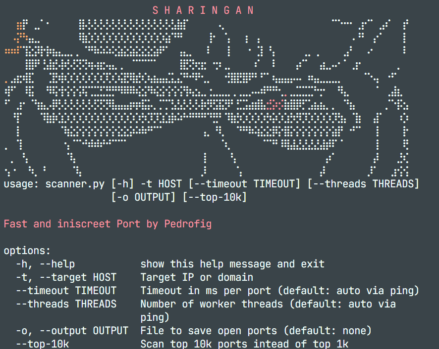

# Sharingan | TCP Port Scanner

A Python port scanner developed by **Pedrofig**, featuring a terminal interface, concurrent connections, and result exports. This project helps you explore network programming and identify accessible TCP ports on an authorized host.



> Only scan equipment you own or have explicit permission to test. Scanning may generate logs and security alerts.

## Features

- Accepts an IPv4 address or domain as the target.
- Tests TCP connections using `socket.connect_ex`.
- Distributes ports across worker threads through a queue.
- Supports configurable timeouts and thread counts.
- Estimates the timeout automatically using ping when no manual value is provided.
- Displays open ports during execution and a summary at the end.
- Saves open port numbers to a text file.
- Displays colored Unicode Braille art with a width that adapts to the terminal.

## Requirements

- **Python 3.10 or later**.
- **pip**, to install the `pythonping` dependency.
- A terminal with Unicode and ANSI color support to display the artwork correctly.
- Network access to the host being tested.

Automatic ping uses ICMP and may require administrator or root privileges. A positive `--timeout` skips this step, but the `pythonping` library is still required to import the program.

## Installation

Download or clone this repository and open a terminal in the folder containing `scanner.py`.

### Windows / PowerShell

```powershell
py -m venv .venv
.\.venv\Scripts\Activate.ps1
python -m pip install pythonping
```

If the `.venv` folder already exists, you do not need to create it again. Once activated, the terminal usually displays `(.venv)` before the path.

If PowerShell blocks activation, you can use the environment's Python executable directly without changing the execution policy:

```powershell
.\.venv\Scripts\python.exe -m pip install pythonping
.\.venv\Scripts\python.exe scanner.py --help
```

### Linux / macOS

```bash
python3 -m venv .venv
source .venv/bin/activate
python -m pip install pythonping
```

## Usage

### View Help

```bash
python scanner.py --help
```

The `-t` argument is required to start a scan. Provide only the IP address or domain, without `http://`, paths, or a port number.

> **Current status:** the examples use `--top-10k` because the default `TOP1K` list contains invalid values. See [Current Limitations](#current-limitations) for details.

### Scan Your Own Computer

```bash
python scanner.py -t 127.0.0.1 --top-10k --timeout 500
```

This command tests the ports in the alternative list on your local computer, using a timeout of **500 milliseconds per connection** and **30 threads**. Results depend on running services and firewall rules.

### Adjust Threads and Save Results

```bash
python scanner.py -t 127.0.0.1 --top-10k --timeout 500 --threads 20 -o open_ports.txt
```

The file is created at the specified path and stores one port number per line. If it already exists, new results are **appended** without deleting previous content. The order depends on when connections finish, and duplicates may occur.

### Use the Automatic Timeout

```bash
python scanner.py -t 127.0.0.1 --top-10k
```

Without a manual timeout, the program sends two pings and calculates the value as **average RTT in milliseconds + 80 ms**. If ICMP fails due to permissions, provide a positive `--timeout`. Networks that block ping may make this estimate unreliable for TCP connections.

## Options

| Option           | Description                                                     | Default            |
| ---------------- | --------------------------------------------------------------- | ------------------ |
| `-h`, `--help`   | Displays help and exits.                                        | Not applicable     |
| `-t`, `--target` | IPv4 address or domain of the authorized host.                  | Required           |
| `--timeout`      | Timeout per connection in milliseconds. Use a positive integer. | Automatic via ping |
| `--threads`      | Number of worker threads. Use a positive integer.               | `30`               |
| `-o`, `--output` | Path to the file that will store open ports.                    | No file            |
| `--top-10k`      | Selects `TOP10K` instead of `TOP1K`.                            | Disabled           |

The thread count is not calculated using ping: the default in the code is `30`, despite the current help text. More threads increase concurrency, but may also increase load and affect result accuracy.

## How It Works

1. The program displays the artwork and parses the arguments.
2. It sets the timeout manually or estimates it using ping.
3. It places entries from the selected port list into a queue.
4. Worker threads retrieve ports from the queue and attempt TCP connections over IPv4.
5. When `connect_ex` returns `0`, the port is recorded as open and optionally written to a file.
6. Once finished, the program displays the number of open port records and the total execution time.

An open port means the TCP connection was accepted. This **does not prove a vulnerability** or identify which service is running. Ports that are not displayed may be closed, filtered, or unreachable.

## Current Limitations

- **Port lists need revision:** `TOP1K` has 615 entries, including 154 values outside the valid port range. Expressions such as `3-4` are subtraction operations in Python, not ranges; this may cause worker errors and incomplete results.
- **Alternative mode:** `TOP10K` has 8,344 entries, all within the valid range, but includes duplicates. The mode name does not represent 10,000 unique ports.
- **Displayed count:** the summary uses the fixed values `1000` or `10000`, rather than the actual number of ports tested. Duplicate entries may also produce repeated open port records.
- **Scope:** the implementation uses TCP and IPv4. UDP, IPv6, CIDR ranges, custom port selection, and service identification are not supported.
- **Validation:** numeric arguments are not fully validated yet. Use timeout and thread values greater than zero.
- **Results:** short timeouts, firewalls, and network conditions may prevent an accessible port from being detected. The scanner does not distinguish all of these cases.

## Project Structure

```text
scannerP/
  scanner.py                  # Scanner, arguments, and integrated artwork
  arte.py                     # Standalone artwork display
  img/
    sharinganPortS.png.png     # Screenshot used in this README
  README.md
```

To display only the artwork without starting a scan:

```bash
python arte.py
```

## Troubleshooting

| Message or issue                          | What to check                                                                                        |
| ----------------------------------------- | ---------------------------------------------------------------------------------------------------- |
| `can't open file ... scannerr.py`         | The correct filename is `scanner.py`, with only one `r` at the end of `scanner`.                     |
| `No module named 'pythonping'`            | Run `python -m pip install pythonping` in the same environment used for the scanner.                 |
| `venv/Scripts/activate` is not recognized | The folder used in these instructions is `.venv`; in PowerShell, run `.\.venv\Scripts\Activate.ps1`. |
| Missing `-t/--target` argument            | Provide a host, such as `-t 127.0.0.1`.                                                              |
| Permission error when pinging             | Provide `--timeout 500` to skip automatic ping.                                                      |
| `getaddrinfo failed`                      | Check the domain and DNS resolution. Do not include a protocol or path in the target.                |
| Broken or clipped artwork                 | Use a font with Unicode Braille support and enlarge the terminal panel.                              |

## Contributing

Suggestions and fixes are welcome. Useful improvements include reviewing the port lists, removing duplicates, correcting the summary count, and adding argument validation and automated tests.
